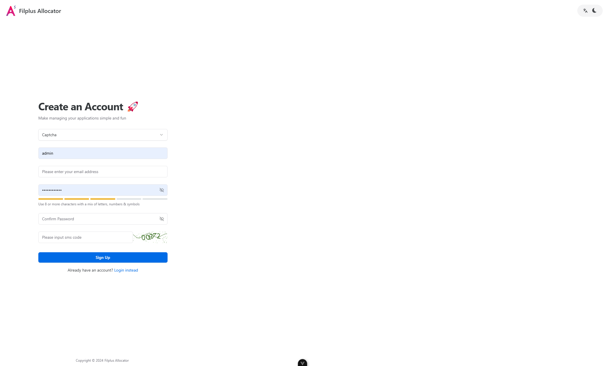
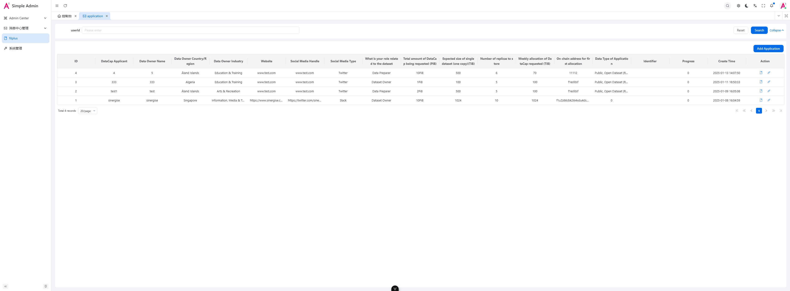
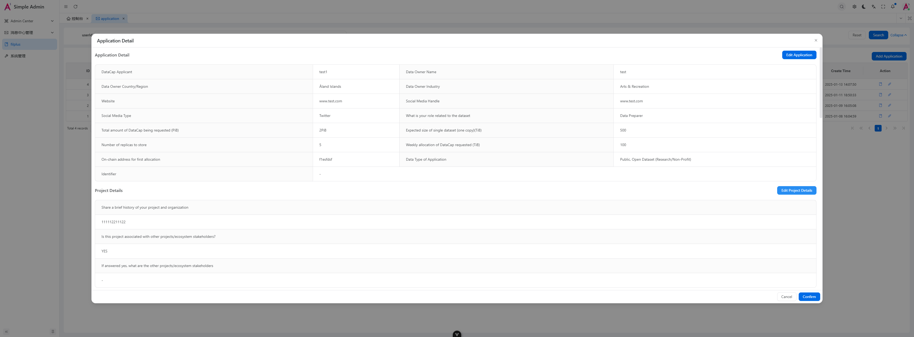

<h1>Filplus Allocator</h1>

**English** | [中文](./README.zh-CN.md)

## Introduction

IPFSYUN developed an automatic distributor based on the official distributor. Some UI frameworks are Vben Admin.
First register an account, then apply, and you can start distributing after review.

### Preview

   

## Browser support

The `Chrome 80+` browser is recommended for local development

Support modern browsers, not IE

|  IE |  Edge |  Firefox |  Chrome |  Safari |
| :-: | :-: | :-: | :-: | :-: |
| not support | last 2 versions | last 2 versions | last 2 versions | last 2 versions |

## License

[Apache2.0 © Ryan-2022](.originallicense/LICENSE)
