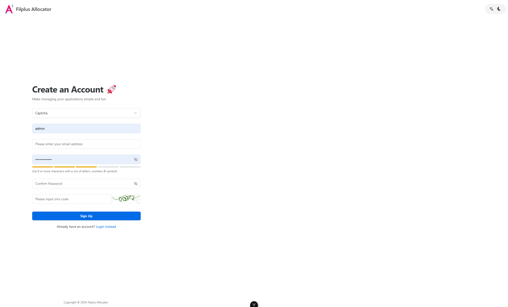

 

<h1>Filplus Allocator Vben5 UI</h1>

**中文** | [English](./README.En.md)

## 简介

IPFSYUN以官方分配器为原型开发的自动分配器，选取的UI框架是Vben Admin。
首先注册账号，再申请，经过审核即可开始分配

## 预览

   

## 浏览器支持

本地开发推荐使用`Chrome 80+` 浏览器

支持现代浏览器, 不支持 IE

|  IE |  Edge |  Firefox |  Chrome |  Safari |
| :-: | :-: | :-: | :-: | :-: |
| not support | last 2 versions | last 2 versions | last 2 versions | last 2 versions |

## License

[Apache2.0 © Ryan-present](.originallicense/LICENSE)
